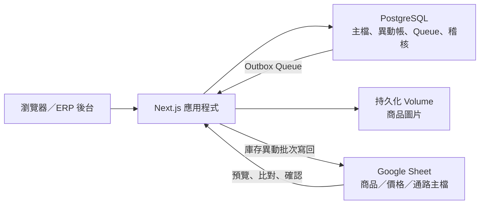
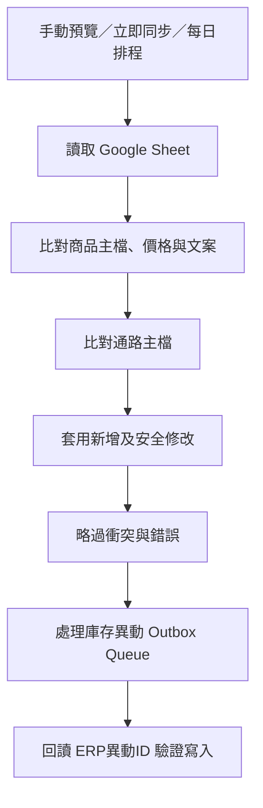

# Neverland ERP

Neverland ERP 是為品牌商品、總倉、直營與寄賣通路設計的輕量庫存後台。系統以 PostgreSQL 的「庫存異動帳」作為正式資料來源，從異動即時計算各 SKU 在總倉及各通路的庫存，並提供銷售分析、商品圖片、帳號權限、Google Authenticator 雙重驗證，以及 Google Sheet 主檔／庫存異動同步。

目前專案位置：`/Users/richard/Desktop/neverland-erp`

## 系統定位與資料權責

這套系統不是把 Google Sheet 當成即時資料庫。各資料的正式來源如下：

| 資料 | 正式來源 | 同步方向 |
| --- | --- | --- |
| 使用者、權限、安全設定 | PostgreSQL | 不同步到 Sheet |
| 商品、價格、商品文案 | Google Sheet 主檔／PostgreSQL | 日常以 Sheet → ERP 為主 |
| 通路主檔 | Google Sheet 主檔／PostgreSQL | 日常以 Sheet → ERP 為主 |
| 庫存異動 | PostgreSQL 不可變更帳本 | ERP Queue → Google Sheet |
| 即時庫存 | 由 PostgreSQL 異動帳即時計算 | 不另外儲存庫存餘額 |
| 商品圖片路徑 | PostgreSQL | 圖片檔存於持久化 Volume |
| 商品圖片檔案 | Docker／Zeabur Volume | 不會自動同步到 Google Sheet |



核心原則：

- PostgreSQL 是 ERP 的正式帳本，Google Sheet 是主檔來源及相容的異動檢視表。
- 庫存不是一個可以直接覆寫的數字，而是所有有效異動加總後的結果。
- 已有歷史關聯的商品、通路與異動不能任意刪除，以免破壞帳務。
- Google Sheet 同步不是整份覆蓋，也不是只看日期；主檔使用唯一鍵、內容雜湊與上次同步基準判斷。

## 已完成的功能

### 儀表板

- 全域日期、通路與商品篩選。
- 7、30、90 天及全期間快捷篩選。
- 銷售額／銷量趨勢切換。
- 銷售通路占比。
- 熱銷與滯銷商品排行。
- KPI 與前一期比較。
- 即時可用庫存與低庫存 SKU。

### 庫存與異動

- 以商品為主的即時庫存卡片，再進入各 SKU／尺寸明細。
- 顯示總倉、各寄賣據點庫存及可調貨位置。
- SKU、商品名稱、尺寸搜尋。
- 庫存狀態、據點篩選與多種排序。
- 進貨、出貨、寄賣出貨、寄賣退回、寄賣售出、買斷、瑕疵與庫存調整。
- 倉庫及寄賣通路的負庫存防呆。
- 異動沖銷與操作者稽核紀錄。

### 主檔

- 商品 SKU、名稱、尺寸、安全庫存、定價、經銷價、成本及文案。
- 商品圖片可留白，支援 JPEG、PNG、WebP。
- 通路類型：系統、直營、寄賣、買斷。
- 商品與通路可啟用、停用；沒有歷史異動時才可真正刪除。

### 帳號與安全

- 管理員、庫存人員、檢視者三種角色。
- 顯示名稱可由管理員修改；登入 Email 目前不可在後台修改。
- 帳號停用、啟用、密碼重設及登入裝置撤銷。
- 首次使用臨時密碼時強制變更密碼。
- 登入失敗鎖定與安全稽核。
- Google Authenticator 相容 TOTP、一次性備援碼及驗證碼重放防護。

### Google Sheet

- 後台設定試算表 URL／ID。
- 連線測試、手動預覽、確認後寫入。
- 每日定時同步。
- 商品、價格、文案與通路主檔同步。
- 庫存異動 Outbox Queue、立即同步、重試及防重複。
- 同步歷史、衝突、錯誤與 Queue 狀態顯示。

## 技術架構

| 層級 | 技術 |
| --- | --- |
| 前端 | Next.js 16、React 19、TypeScript |
| 圖表 | Recharts |
| 後端 | Next.js Route Handlers |
| ORM | Prisma 6 |
| 資料庫 | PostgreSQL 16 |
| 驗證 | Cookie Session、bcrypt、TOTP |
| 圖片 | Sharp、WebP |
| Google 整合 | Google Sheets API、Service Account |
| 執行環境 | Node.js 24、Docker |
| 部署 | Zeabur |

## 庫存帳本邏輯

### 異動如何影響數量

| 異動 | 總倉 | 寄賣庫存 | 售出 | 瑕疵 |
| --- | ---: | ---: | ---: | ---: |
| 進貨 `RECEIVE` | `+數量` | 0 | 0 | 0 |
| 出貨 `SHIP` | `-數量` | 0 | `+數量` | 0 |
| 寄賣出貨 `CONSIGN_OUT` | `-數量` | `+數量` | 0 | 0 |
| 寄賣退回 `CONSIGN_RETURN` | `+數量` | `-數量` | 0 | 0 |
| 寄賣售出 `CONSIGN_SOLD` | 0 | `-數量` | `+數量` | 0 |
| 買斷 `BUYOUT` | `-數量` | 0 | `+數量` | 0 |
| 瑕疵 `DEFECT` | `-數量` | 0 | 0 | `+數量` |
| 庫存調整 `ADJUSTMENT` | `+數量` | 0 | 0 | 0 |

目前表單的庫存調整數量必須是正整數，因此適合增加庫存；若要減少庫存，應使用對應事件或後續擴充「調整原因／正負方向」。

### 通路要求

- 出貨、寄賣出貨、寄賣退回、寄賣售出、買斷必須選擇通路。
- 寄賣出貨、寄賣退回、寄賣售出只能使用 `CONSIGNMENT` 類型通路。
- 進貨、瑕疵及庫存調整可不指定通路。
- 沒有通路的異動寫回舊 Google Sheet 時，C 欄會使用技術值「初始化」。
- 「初始化」不是實際營業通路，因此主檔同步會忽略它，也不會建立成 ERP 通路。

### 負庫存防護

- 出貨、寄賣出貨、買斷與瑕疵不可超過目前總倉庫存。
- 寄賣退回與寄賣售出不可超過指定通路目前持有的寄賣庫存。
- 新增異動使用 PostgreSQL `Serializable` 交易，降低同時操作造成超賣的風險。

### 沖銷

異動不直接編輯或刪除。沖銷會：

1. 標記原異動的 `reversedAt`。
2. 建立一筆相同類型、相反數量的關聯異動。
3. 再次檢查沖銷後是否會形成負庫存。
4. 將沖銷異動加入 Google Sheet Queue。
5. 建立稽核紀錄。

同一筆異動只能沖銷一次；沖銷異動本身不能再次沖銷。

## 商品與通路狀態

停用不是刪除：

- 停用後資料仍保留於 PostgreSQL，歷史異動與報表不會消失。
- 停用的商品或通路不應再用於新的日常操作。
- 已有任何庫存異動的商品或通路不能刪除，只能停用。
- 完全沒有關聯異動的商品或通路才可刪除。
- Google Sheet 刪除一列不會自動刪除或停用 ERP 資料，避免人為誤刪造成帳務缺口。

## 即時庫存與調貨顯示

- 每一個 SKU 的庫存都是從完整異動帳加總，不使用獨立的 `stock` 欄位。
- `總庫存 = 總倉 + 寄賣庫存`，不包含已售出與瑕疵。
- 低庫存判斷目前使用 `總倉 <= 安全庫存`。
- 商品列表會以共用圖片或商品名稱將尺寸 SKU 組成同一款商品。
- 商品明細保留各 SKU／尺寸的總倉、寄賣、售出與瑕疵數量。
- 可調貨位置只顯示數量大於 0 的總倉或寄賣據點。

## 儀表板計算邏輯

銷售事件只包含：

- 出貨 `SHIP`
- 寄賣售出 `CONSIGN_SOLD`
- 買斷 `BUYOUT`

計算方式：

- 銷售額：`異動單價 × 異動數量` 後加總。
- 售出件數：銷售事件數量加總。
- 銷售筆數：未被沖銷、且不是沖銷反向列的正數銷售事件筆數。
- 平均單件估值：`銷售額 ÷ 售出件數`。
- 前期比較：用目前日期範圍的相同天數，往前緊鄰的一段期間。
- 預設日期範圍：資料最後日期往前 30 天；若資料不足則使用全部期間。
- 熱銷排行：依篩選期間售出件數由高至低。
- 滯銷排行：包含零銷量商品，先依銷量由低至高，再參考目前庫存。

注意：

- 新增銷售異動時單價必填。
- 歷史匯入資料若缺少單價，儀表板會以 `NT$0` 計入；這會低估營收。
- 沖銷列使用負數數量及原單價，因此會抵銷原本的件數與營收。
- 商品篩選目前以商品名稱為維度，不是單一 SKU／尺寸。

## Google Sheet 同步總覽

同步順序固定為：



### 三種執行方式

#### 手動預覽

1. 管理員按「從 Google Sheet 預覽主檔」。
2. 系統只讀取並分類為新增、修改、衝突、錯誤、相同。
3. 管理員確認後，系統只寫入新增與安全修改。
4. 衝突與錯誤留在報告，不會覆蓋 PostgreSQL。
5. 手動預覽本身不處理庫存異動 Queue。

#### 馬上同步全部

1. 自動執行主檔同步規則。
2. 主檔的安全變更直接套用。
3. 衝突與錯誤略過。
4. 主檔處理完成後，再送出庫存異動 Queue。

#### 每日定時同步

- 每天依後台設定的 IANA 時區與時間執行一次。
- 預設為 `Asia/Taipei` 每日 `03:00`，但目前是否啟用以資料庫設定為準。
- Scheduler 每分鐘檢查一次。
- 如果容器在排程時間離線，同一天稍後恢復時會補跑。
- 每日唯一 `scheduleKey` 可避免多個應用容器重複執行同一天的主檔同步。
- 應用程式完全停止時不會執行排程，因此 Zeabur 服務不可在排程期間休眠或關閉。

## Google Sheet 主檔欄位

系統目前要求以下分頁名稱及範圍：

| 分頁 | 讀取範圍 | 用途 |
| --- | --- | --- |
| `商品主檔` | `B:E` | SKU、商品名稱、尺寸、安全庫存 |
| `商品總覽` | `B:H` | SKU、定價、經銷價、成本、商品文案 |
| `通路主檔` | `A:B` | 通路名稱、通路類型 |
| `庫存異動` | 寫入 `A:C`、`E:F`、`N:R` | ERP 庫存異動寫回 |

同步規則：

- SKU 是商品唯一鍵；通路名稱是通路唯一鍵。
- `商品總覽` 一格可以用空白分隔多個 SKU。
- 商品名稱不可空白。
- 安全庫存必須是非負整數。
- 價格與成本若有值，必須是非負數。
- 商品主檔或通路主檔的重複唯一鍵會列為錯誤。
- 商品總覽出現、但商品主檔不存在的 SKU 會列為錯誤。
- 通路類型只接受「系統、直營、寄賣、買斷」。
- Sheet 的價格或文案空白時會保留 ERP 既有值，不會用空白清除。
- Sheet 缺少一列不會自動刪除或停用 ERP 資料。

### 新增、修改與衝突如何判斷

系統不是使用日期判斷，也不會整表覆蓋。每個商品及通路都會保存：

- 試算表 ID。
- 實體類型與唯一鍵。
- 上次同步時的 Sheet 內容雜湊。
- 上次同步時的 PostgreSQL 內容雜湊。

比對結果：

- `NEW`：ERP 找不到相同 SKU／通路。
- `UNCHANGED`：Sheet 與 ERP 內容相同。
- `MODIFIED`：內容不同，但可以安全套用。
- `CONFLICT`：ERP 在上次同步後也被修改，系統不自動覆蓋。
- `ERROR`：欄位格式、重複鍵或關聯資料有問題。

真正寫入前會再次檢查 PostgreSQL 內容雜湊；若預覽後又有人修改資料，該筆會被略過，避免使用過期預覽覆蓋新資料。

不同試算表 ID 使用不同的同步基準。更換同步來源時，不會沿用上一份試算表的雜湊狀態，尚未確認的舊預覽也會取消。

## 庫存異動 Queue 與 Sheet 寫回

ERP 建立異動或沖銷時，異動本身與 Queue 項目會在同一個資料庫交易內建立。即使 Google API 當下不可用，ERP 異動仍保留在等待區，不會遺失。

Queue 狀態：

| 狀態 | 說明 |
| --- | --- |
| `PENDING` | 等待同步 |
| `PROCESSING` | 已被某個同步程序領取 |
| `SYNCED` | Google Sheet 寫入及回讀驗證完成 |
| `FAILED` | 寫入失敗，等待下一次符合條件的同步 |

目前處理規則：

- 每批最多處理 100 筆。
- 使用 `processingToken` 避免同一筆被兩個程序同時領取。
- 超過 10 分鐘仍停在 `PROCESSING` 會恢復為失敗待重試。
- 失敗後至少等待 15 分鐘才符合再次處理條件。
- 最多嘗試 10 次；之後需要人工檢查資料及重新排程。
- Queue 不會因為本地 Demo 模式而標示成功。
- 「馬上同步全部」會處理已符合重試時間的 Queue。
- 定時同步目前每日執行一次，因此失敗資料不保證每 15 分鐘自動重送；可由管理員稍後按「馬上同步」。

### 寫入欄位

| 欄位 | 內容 |
| --- | --- |
| A | 日期，依同步設定時區 |
| B | SKU |
| C | 通路；無通路時為「初始化」 |
| E | 事件 |
| F | 數量 |
| N | `ERP異動ID` |
| O | 成交單價 |
| P | 單號 |
| Q | 備註 |
| R | 同步時間 |

D 與 G:M 不由 ERP 覆寫，保留給原試算表公式。N:R 若完全空白，系統可建立標題；若已有其他標題且不符合預期，系統會中止，避免破壞既有資料。

`ERP異動ID` 是防重複鍵。重試前系統會掃描 N 欄；若已存在相同 ID，就沿用原列而不再新增。

寫入後系統會回讀 N 欄，確認每一個異動 ID 都存在，才把 Queue 標示為 `SYNCED`。

舊試算表注意事項：

- 瑕疵事件寫入時使用原表既有文字「蝦疵」，這是為了相容舊公式。
- `ADJUSTMENT` 目前無法安全映射到舊表，Queue 會失敗。若同批含有庫存調整，該批都可能被標示失敗，應先擴充 Sheet 事件規則再使用。
- 若 M 欄顯示「請檢查主檔」，代表 Sheet 自己的公式找不到 SKU 或主檔範圍不一致，不代表 ERP 寫入失敗。

## Google Service Account 設定

### Google Cloud

1. 在 Google Cloud 專案啟用 Google Sheets API。
2. 建立 Service Account。
3. 建立並下載 JSON 金鑰。
4. 取得 JSON 中的 `client_email`。
5. 將目標 Google Sheet 分享給該 Email，權限設為「編輯者」。
6. 將 JSON 以部署平台的機密環境變數提供給應用程式。

只有公開連結不足以讓系統安全寫入。應用程式使用 Service Account 身分呼叫 Google Sheets API。

### 本地 Docker

先將 JSON 轉為單行 Base64：

```bash
base64 < /完整路徑/service-account.json | tr -d '\n'
```

將結果放入未提交 Git 的 `.env`：

```env
GOOGLE_SERVICE_ACCOUNT_JSON=<上一步的單行 Base64>
```

再重建應用容器：

```bash
docker compose up -d --force-recreate app
```

若只要一次性測試、不想寫入 `.env`：

```bash
GOOGLE_SERVICE_ACCOUNT_JSON="$(base64 < /完整路徑/service-account.json | tr -d '\n')" \
docker compose up -d --force-recreate app
```

這種一次性注入會保留於目前容器，但下次未帶相同環境變數重建容器時會消失。

### 更換金鑰

1. 建立新金鑰或新的 Service Account。
2. 先把新 Service Account 加入 Sheet 並設為編輯者。
3. 更新本地 `.env` 或 Zeabur 的 `GOOGLE_SERVICE_ACCOUNT_JSON`。
4. 重建／重新部署應用。
5. 在「Google Sheet 同步」頁按「測試連線」。
6. 實際完成一筆可回復的讀寫測試。
7. 確認成功後才撤銷舊金鑰及移除舊帳號的 Sheet 權限。

Service Account JSON 不會儲存在 PostgreSQL，也不會顯示於後台。

### 更換試算表

管理員可在 `/settings/sync` 貼上新的 Google Sheet URL 或 ID：

1. 測試連線。
2. 確認必要分頁都存在。
3. 驗證並儲存。

儲存後手動同步、每日排程與 Queue 都會使用新試算表，不必重新部署。變更前應先確定舊 Queue 已處理完成，否則等待中的異動會送到新試算表。

## 本地 Docker 啟動

需求：

- Docker Desktop
- 可用連接埠 `3000`

建立本地設定：

```bash
cp .env.example .env
```

啟動：

```bash
docker compose up --build
```

開啟 <http://localhost:3000>。

未自訂環境變數時的本地示範帳號：

- Email：`admin@example.com`
- 密碼：`change-me-now`

正式部署不可使用上述密碼。

背景啟動：

```bash
docker compose up -d --build
```

查看狀態與日誌：

```bash
docker compose ps
docker compose logs -f app
```

停止但保留資料：

```bash
docker compose down
```

停止並刪除 PostgreSQL 與圖片 Volume：

```bash
docker compose down -v
```

最後一個指令會永久刪除本地資料庫與商品圖片，只能在確定有備份時使用。

### Docker 持久化

本地 Compose 使用兩個 Volume：

| Volume | 內容 |
| --- | --- |
| `stockflow_db` | PostgreSQL 資料 |
| `stockflow_uploads` | `/data/uploads` 商品圖片 |

容器重建不會刪除 Volume；`docker compose down -v` 才會刪除。

掛載 Volume 只代表資料在容器重建後仍存在，不等於備份。仍需定期建立 PostgreSQL dump，並另外備份圖片 Volume。

PostgreSQL 備份範例：

```bash
docker compose exec -T db pg_dump -U stockflow -d stockflow -Fc > neverland-erp.dump
```

## 不使用 Docker 開發

先準備 PostgreSQL，將 `.env.example` 複製為 `.env` 並調整 `DATABASE_URL`：

```bash
npm install
npx prisma migrate deploy
npm run db:seed
npm run dev
```

常用檢查：

```bash
npm run lint
npm run build
```

## 環境變數

| 變數 | 用途 | 注意事項 |
| --- | --- | --- |
| `DATABASE_URL` | PostgreSQL 連線 | 正式環境使用 Zeabur PostgreSQL |
| `ADMIN_NAME` | 初始管理員顯示名稱 | 只在空資料庫第一次建立管理員時使用 |
| `ADMIN_EMAIL` | 初始管理員 Email | 後續部署不會覆蓋既有帳號 |
| `ADMIN_PASSWORD` | 初始管理員密碼 | 至少 10 字元；正式環境必須更換 |
| `TOTP_ENCRYPTION_KEY` | 加密 TOTP 種子 | 必須為 32 bytes；設定後不可任意更換 |
| `UPLOAD_DIR` | 商品圖片目錄 | Docker／Zeabur 建議 `/data/uploads` |
| `GOOGLE_SHEET_ID` | 尚無後台設定時的預設 Sheet ID | 後台儲存值會優先 |
| `GOOGLE_SERVICE_ACCOUNT_JSON` | 完整 Service Account JSON 或單行 Base64 | 建議使用機密環境變數 |
| `GOOGLE_SERVICE_ACCOUNT_EMAIL` | 分拆式憑證 Email | 與 `GOOGLE_PRIVATE_KEY` 擇一組使用 |
| `GOOGLE_PRIVATE_KEY` | 分拆式私鑰 | 換行可使用 `\n` |
| `GOOGLE_SHEET_SYNC_ENABLED` | 尚無後台設定時的排程預設值 | `true` 才預設啟用 |
| `GOOGLE_SHEET_SYNC_TIME_ZONE` | 同步時區 | 預設 `Asia/Taipei` |
| `GOOGLE_SHEET_SYNC_HOUR` | 同步小時 | 0–23 |
| `GOOGLE_SHEET_SYNC_MINUTE` | 同步分鐘 | 0–59 |
| `GOOGLE_SHEETS_DEMO_FILE` | 本地快照路徑 | 無憑證的本地測試用途 |

環境變數只提供初始預設。試算表 ID、排程啟用狀態、時區與時間一旦由後台儲存，就以 PostgreSQL 的設定為準。

## 帳號、角色與安全

### 角色

| 功能 | 管理員 | 庫存人員 | 檢視者 |
| --- | :---: | :---: | :---: |
| 查看儀表板、庫存、主檔 | ✓ | ✓ | ✓ |
| 建立／沖銷庫存異動 | ✓ | ✓ | — |
| 新增、停用、刪除商品與通路 | ✓ | ✓ | — |
| 使用者管理 | ✓ | — | — |
| Google Sheet 設定與同步 | ✓ | — | — |
| 修改自己的密碼／TOTP | ✓ | ✓ | ✓ |

### 帳號狀態

- 停用帳號不會刪除使用者。
- 停用時會撤銷該使用者目前所有 Session。
- 稽核紀錄與過去建立的異動仍保留。
- 管理員不能停用自己或移除自己的管理員權限。
- 系統至少保留一位啟用中的管理員。
- 顯示名稱可以修改；登入 Email 目前固定。

### 密碼與登入

- 新密碼至少 10 字元，需包含英文大寫、小寫與數字。
- 管理員建立使用者或重設密碼時會產生一次性臨時密碼。
- 臨時密碼使用者登入後，必須先變更密碼才能使用其他 API。
- 變更密碼會撤銷同帳號的其他 Session。
- 連續 5 次登入失敗會鎖定 15 分鐘。
- Session 有效期為 7 天。
- 變更狀態、密碼、登入及同步等重要操作都有 `AuditLog`。

### Google Authenticator

- 使用標準 TOTP，不是 Google OAuth 登入。
- 驗證碼為 6 位數，每 30 秒更新。
- TOTP 種子以 AES-256-GCM 加密後存入 PostgreSQL。
- 啟用後產生 10 組一次性備援碼，資料庫只保存雜湊。
- 使用過的 TOTP 時間步或備援碼不能重複使用。
- 二階段登入挑戰有效 5 分鐘，最多嘗試 5 次。
- 啟用、停用或重建備援碼會撤銷其他 Session。

`TOTP_ENCRYPTION_KEY` 必須是固定的 32-byte 金鑰，建議使用：

```bash
openssl rand -hex 32
```

啟用任何使用者的 TOTP 後，如果遺失或更換此金鑰，既有 TOTP 種子將無法解密，使用者必須重新設定。

目前沒有 Google 帳號登入；Google Authenticator 只負責第二因素驗證。

## 商品圖片

新增商品時圖片可留白。上傳規則：

- 支援 JPEG、PNG、WebP。
- 單檔上限 8 MB。
- 最多解析 4,000 萬像素，避免異常大圖耗盡記憶體。
- 自動依 EXIF 方向旋轉。
- 主圖縮放至最大 1600 × 1600，不放大原圖，轉 WebP quality 84。
- 縮圖裁切為 320 × 320，轉 WebP quality 78。
- PostgreSQL 只保存相對路徑。
- 實際檔案保存在 `UPLOAD_DIR/products`。

Google Sheet 日常主檔同步目前不會自動下載或更新圖片。既有 Sheet 圖片使用一次性匯入腳本處理；後續新增商品可直接在 ERP 上傳。

## 一次性資料匯入腳本

### 完整 Sheet 快照匯入

```bash
npm run db:import-sheet
```

此腳本讀取 `prisma/google-sheet-data.json`，是一次性遷移工具，不是日常同步。它目前具有以下保護與限制：

- 硬性檢查指定試算表 ID。
- 硬性預期 73 個商品、15 個通路、1103 筆異動。
- 會刪除全部既有庫存異動後重新建立。
- 會刪除不在快照中的商品與通路。
- 歷史銷售單價以商品定價估算。
- 三個已人工確認的 SKU 定價覆寫為 3080。

先執行 Dry Run：

```bash
IMPORT_DRY_RUN=1 npm run db:import-sheet
```

除非正在重建空資料庫且已完成備份，正式環境不可直接執行完整匯入。

### Sheet 圖片匯入

```bash
npm run db:import-sheet-images
```

此腳本依 `prisma/google-sheet-images/manifest.json` 將 31 組圖片連結到 73 個 SKU，並取代這些商品原本的圖片路徑。執行前可使用：

```bash
IMPORT_IMAGES_DRY_RUN=1 npm run db:import-sheet-images
```

## Seed 注意事項

容器啟動時會執行：

1. `prisma migrate deploy`
2. `npm run db:seed`
3. `node server.js`

Seed 是冪等的，不會覆蓋既有管理員密碼或已存在的 SKU；但在全新空資料庫中，它會建立：

- 初始管理員。
- 5 個示範商品。
- 6 個示範通路。
- 當資料庫完全沒有異動時，建立示範庫存與銷售異動。

正式新環境若不希望出現示範資料，應在部署前拆分「管理員初始化」與「Demo seed」。目前已有正式匯入資料的資料庫重新部署時，不會再次建立示範異動。

## Zeabur 部署

專案包含 `Dockerfile`，容器會自動執行 migration 與 seed。目前 `.zeabur/deploy.json` 已設定：

- 專案：Neverland
- 服務：`neverland-erp`
- 網域：<https://neverland-erp.zeabur.app>

Zeabur Web 服務至少需要：

```env
DATABASE_URL=<Zeabur PostgreSQL 連線字串>
ADMIN_NAME=<初始管理員顯示名稱>
ADMIN_EMAIL=<初始管理員 Email>
ADMIN_PASSWORD=<安全的初始密碼>
TOTP_ENCRYPTION_KEY=<固定的 32-byte 金鑰>
UPLOAD_DIR=/data/uploads
GOOGLE_SERVICE_ACCOUNT_JSON=<Service Account JSON 的單行 Base64>
GOOGLE_SHEET_SYNC_ENABLED=false
GOOGLE_SHEET_SYNC_TIME_ZONE=Asia/Taipei
GOOGLE_SHEET_SYNC_HOUR=3
GOOGLE_SHEET_SYNC_MINUTE=0
```

部署檢查：

- 建立並連接 PostgreSQL 服務。
- 將商品圖片持久化 Volume 掛載到 `/data/uploads`。
- 環境變數使用 Zeabur Secret，不要提交金鑰。
- 第一次登入後立即更換初始密碼。
- 到同步設定測試 Google API 讀取及寫入。
- 確認時區與排程啟用狀態。
- 設定 PostgreSQL 備份及圖片 Volume 的異地備份。

重要：Zeabur Volume 可避免重新部署遺失圖片，但不等於備份。若主機、專案或 Volume 被刪除，仍可能失去資料。

## 常見問題

### 顯示「Google Service Account 尚未設定」

- 確認 `GOOGLE_SERVICE_ACCOUNT_JSON` 已設定於目前服務。
- 若值是 Base64，確認沒有換行或多餘空白。
- 修改後必須重新建立容器或重新部署。

### Google API 回傳 403

- Google Cloud 是否已啟用 Google Sheets API。
- Service Account `client_email` 是否已加入正確的試算表。
- Queue 寫入需要「編輯者」，只有檢視者不足。
- 後台目前設定的 Sheet ID 是否正確。

### 連線成功但 Queue 無法寫入

- 確認 `庫存異動` 分頁存在。
- 確認至少有 A:R 共 18 欄。
- 確認 N:R 標題為 `ERP異動ID、成交單價、單號、備註、同步時間`，或完全空白讓系統建立。
- 確認 Queue 沒有不支援的 `ADJUSTMENT`。
- 查看後台 Queue 的 `lastError`。

### Sheet 顯示「請檢查主檔」

這通常是 Sheet 的 D 或 G:M 公式找不到 SKU，需檢查：

- SKU 是否與商品主檔完全一致。
- 前後是否有空白。
- 公式的查找範圍是否包含新增列。
- ArrayFormula 是否仍正常。

ERP 只寫 A:C、E:F、N:R，不會改寫 D、G:M。

### 商品單價仍是空白

- 確認 SKU 同時存在於 `商品主檔` 與 `商品總覽`。
- 確認 `商品總覽` 的定價欄是有效數字。
- 空白價格會刻意保留 ERP 既有值；如果 ERP 原本也是空白，就仍會是空白。
- 歷史異動單價不會因商品主檔價格更新而回溯改寫。

### 排程沒有執行

- 後台是否啟用每日定時同步。
- 時區是否為有效 IANA 名稱，例如 `Asia/Taipei`。
- Service Account 是否存在且可讀寫。
- 應用容器是否在排程時間後有運行。
- 同一天是否已產生相同 `scheduleKey` 的同步紀錄。

## 目前限制與後續決策

- 不是完全雙向同步：商品／價格／通路主要是 Sheet → ERP，庫存異動是 ERP → Sheet。
- ERP 新增或修改商品主檔目前不會反向寫回 Google Sheet。
- Google Sheet 的歷史庫存異動不會在日常同步中重新匯入 ERP，避免重複帳。
- 庫存調整尚未支援寫回舊 Google Sheet。
- 商品圖片仍是本機／Volume 檔案，不是 S3 相容物件儲存。
- 尚未實作 Google OAuth 登入。
- Email 登入名稱目前不可在後台修改。
- Volume 持久化已支援，但自動異地備份仍需由 Zeabur／維運流程設定。
- 完整資料匯入腳本具有破壞性，只能視為一次性遷移工具。

## 維運原則

- 正式資料變更前先備份 PostgreSQL 與圖片 Volume。
- 不把 `.env`、Service Account JSON、私鑰、正式密碼提交到 Git。
- 不直接修改或刪除歷史 `StockMovement`；使用沖銷。
- 不把商品或通路的「停用」誤認為刪除。
- 主檔同步先看預覽，衝突需人工決定哪一邊正確。
- 更換 Service Account 時先驗證新金鑰，再撤銷舊金鑰。
- 更換 Sheet 前先處理完舊 Queue。
- 定期檢查 Queue 的 `FAILED`、同步紀錄與安全稽核。
